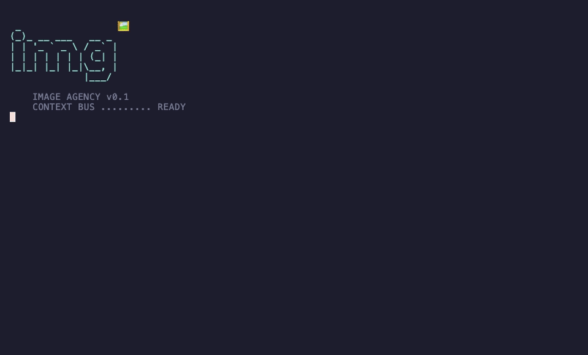

# 🖼️ Image Agency

Image generation for Claude Code, Codex, and the terminal. Built for brand and agency teams who need on-brand assets across one or many client projects.

Calls one of two providers, with **no automatic fallback**:

- OpenAI `gpt-image-2`
- Google `gemini-3.1-flash-image-preview`

<p align="center">
  
</p>

---

## Contents

- [Install](#install)
- [Setup](#setup)
- [Use cases](#use-cases)
- [CLI reference](#cli-reference)
- [Configuration](#configuration)
- [Troubleshooting](#troubleshooting)
- [Uninstall](#uninstall)
- [Develop and contribute](#develop-and-contribute)
- [License](#license)

---

## Install

`img` ships in three forms. Pick the one that matches how you work. Claude Code and Codex users can add the public marketplace directly from GitHub. Terminal users install the CLI on `$PATH`.

### 1. Claude Code plugin

Run this in your terminal, not inside a Claude Code session:

```bash
claude plugin marketplace add https://github.com/nyldn/plugins.git
claude plugin install img@nyldn-plugins
```

`nyldn-plugins` is a shared marketplace catalog at
`https://github.com/nyldn/plugins.git`, and it makes both plugins available:

```bash
claude plugin install octo@nyldn-plugins
claude plugin install img@nyldn-plugins
```

Then start or restart Claude Code and run:

```text
/img:setup
```

The plugin adds these namespaced commands and calls its bundled `bin/img`; a global CLI install is not required for Claude marketplace commands.

| Command | What it does |
|---|---|
| `/img:img <natural language>` | Default generation. OpenAI `gpt-image-2`. |
| `/img:setup` | Run setup and health checks. |
| `/img:openai <prompt>` | Force OpenAI. |
| `/img:gemini <prompt>` | Force Gemini. |
| `/img:edit --input <path> [--provider openai\|gemini] <prompt>` | Edit/restyle a reference image. |

Optional bare `/img` alias (local user scope, not marketplace scope):

```bash
git clone https://github.com/nyldn/img.git
cd img
./scripts/install-claude.sh --bare-alias
```

The namespaced `/img:*` forms are canonical because they stay tied to the installed plugin version. The bare alias does not.

### 2. Codex plugin

```bash
codex plugin marketplace add https://github.com/nyldn/img.git
```

Restart Codex, open `/plugins`, then install or enable `img`. Use it as a natural-language skill:

```text
$img create three on-brand article header images for this project
```

If you want to type `img ...` directly in a terminal or in Codex shell commands, install the CLI separately from the [Terminal CLI](#3-terminal-cli) section.

### 3. Terminal CLI

Install from source:

```bash
git clone https://github.com/nyldn/img.git
cd img
npm link
img activate
```

When the npm package is published, this will also work:

```bash
npm install -g @nyldn/img
img --help
```

### 4. Local development

```bash
git clone https://github.com/nyldn/img.git
cd img
npm install
npm test
claude --plugin-dir "$(pwd)"
```

---

## Setup

Run once after install:

```bash
img activate          # prints the loader banner
img setup             # creates config + env files
img check-health      # verifies install end-to-end
```

In Claude Code, use `/img:setup` for the same setup flow.

`img setup` chooses scope based on cwd:

- **Inside a git repo** -> creates user files **and** project `img.config.json`
- **Outside a git repo** -> user files only

Force a scope:

```bash
img setup --user      # personal machine defaults only
img setup --project   # shared project config only (commit this)
img setup --both      # both, even outside a repo
```

### Where things live

| File | Purpose | Commit? |
|---|---|---|
| `~/.config/img/.env.local` | API keys | **Never** |
| `~/.config/img/config.json` | Personal defaults (provider, output dir, prompts) | No |
| `<project>/img.config.json` | Shared brand prompts, asset types, destinations, cost limits | **Yes** |
| `<project>/.env`, `.env.local` | Project-specific keys (rarely needed) | Never |

### Keys

Add at least one key to `~/.config/img/.env.local`:

```bash
OPENAI_API_KEY=sk-...
GEMINI_API_KEY=...
```

`OPENAI_API_KEY` is required for the default `/img:img` path. `GEMINI_API_KEY` is only needed for `/img:gemini` and Gemini-based edits.

Verify:

```bash
img check-health
```

Reports config layers, key presence (without printing values), output writability, brand reference existence, and project-config status. Run after any `setup` or config change.

Full setup reference: [`docs/setup-file.md`](docs/setup-file.md).

---

## Use cases

### Quick one-off (no project context)

Outside a repo, run from anywhere on `$PATH`:

```bash
img generate a photorealistic 2:1 image of a dog wearing a denim jacket
```

Saves to `./img-output/` or `IMG_OUTPUT_DIR`.

### Inside a Claude Code session

```text
/img:img a clean, minimal app icon for a savings tracker, flat design, mint green
```

The plugin keeps your aspect, style, and subject words in the prompt. No flag translation.

### Restyle a reference image

```bash
img --provider gemini --input ./hero-photo.jpg --prompt "soften the lighting, make it warmer, keep the composition"
```

Or in Claude:

```text
/img:edit --provider gemini --input ./hero-photo.jpg soften the lighting, make it warmer
```

### Brand-consistent assets across a project

Inside a git repo with `img.config.json` configured:

1. Set brand pre-prompts and negative prompts in `img.config.json`:
   ```json
   {
     "brand": {
       "prePrompts": [
         "Use a restrained, premium editorial visual style.",
         "Match the existing site palette."
       ],
       "negativePrompts": ["No watermarks.", "No stock-photo cliches."]
     }
   }
   ```
2. Run any generation. Brand prompts are auto-composed before the user request:
   ```text
   /img:img three feature-card illustrations for the pricing page
   ```
3. Teammates inherit the same brand prompts after `git pull`.

### Multiple clients

Keep one `img.config.json` per client repo. User-level `~/.config/img/config.json` holds personal defaults that apply across all clients.

### Dry-run before spending credits

```bash
img --dry-run --provider openai --prompt "..."
```

Prints provider, model, endpoint, composed prompt, output dir, and resolved config files. No API call.

### Cost ceiling for a project

In `img.config.json`:

```json
{
  "limits": {
    "maxImagesPerRun": 6,
    "maxCostPerRunUsd": 5
  }
}
```

`maxImagesPerRun` is enforced against `--count`. `maxCostPerRunUsd` is currently informational (cost estimation lands with the planning command).

---

## CLI reference

```bash
img activate                                # print loader banner
img setup [--user|--project|--both]         # create config + env files
img check-health                            # diagnose install end-to-end
img <natural language>                      # generate via OpenAI gpt-image-2
img --provider openai|gemini --prompt "..." # explicit provider
img --provider gemini --input REF.png --prompt "..."   # edit/restyle
img --dry-run --prompt "..."                # validate without API call
img --help                                  # full flag list
```

Common flags:

| Flag | Purpose |
|---|---|
| `--provider openai\|gemini` | Pick provider (default: config or `openai`) |
| `--asset-type VALUE` | Use a configured asset type id or alias |
| `--prompt`, `-p` | Prompt text |
| `--input`, `-i` | Reference image (repeat for multiple) |
| `--mask` | OpenAI edit mask |
| `--out`, `-o` | Output dir (default: `./img-output`) |
| `--count`, `-n` | Number of images (1-12, capped by `limits.maxImagesPerRun`) |
| `--size` | OpenAI: `auto\|1024x1024\|1536x1024\|1024x1536` |
| `--quality` | OpenAI: `auto\|low\|medium\|high` |
| `--format` | OpenAI: `png\|jpeg\|webp` |
| `--aspect` | Gemini: `1:1\|16:9\|9:16\|4:3\|3:4\|...` |
| `--image-size` | Gemini: `1K\|2K\|4K` |
| `--config FILE` | Explicit config file |
| `--env-file FILE` | Explicit env file |
| `--cwd DIR` | Resolve config/env relative to DIR |
| `--dry-run` | Validate options, print request metadata, no API call |
| `--open` | Open the first saved image in the OS viewer |

Provider-specific notes: [`docs/providers.md`](docs/providers.md).

---

## Configuration

Layers, highest precedence first:

1. CLI flags
2. Nearest project `img.config.json` (walked up from `cwd` to git root)
3. User `~/.config/img/config.json`
4. Plugin defaults

Env values already set in the shell or agent process win. Missing values are filled from:

1. `--env-file FILE`
2. Nearest project `.env.local`
3. Nearest project `.env`
4. User `~/.config/img/.env.local`

Arrays (e.g. `prompt.prePrompts`) append from low to high precedence and dedupe by string equality. Use `mergeMode: "replace"` on the enclosing object to override instead of append.

Full config schema and field-by-field docs: [`docs/setup-file.md`](docs/setup-file.md), [`schemas/config.schema.json`](schemas/config.schema.json).

---

## Troubleshooting

### `command not found: img`

The terminal CLI is not on `$PATH`. This affects direct shell usage, Codex shell commands, and the optional bare `/img` alias. Claude Code marketplace commands use the plugin-local binary and do not need a global CLI.

Fix:
```bash
git clone https://github.com/nyldn/img.git
cd img
npm link
command -v img
```

If you use npm after publication, `npm install -g @nyldn/img` works too.

### Claude says `Marketplace file not found`

Use the full GitHub URL from a terminal:

```bash
claude plugin marketplace add https://github.com/nyldn/plugins.git
claude plugin install img@nyldn-plugins
```

Then restart Claude Code and run `/img:setup`.

If you previously tried `/plugin marketplace add nyldn/img` inside Claude Code, remove that failed marketplace entry if it appears in `claude plugin marketplace list`, then add the full URL again from the terminal.

### `img` or `octo` fails after adding another nyldn marketplace

Claude indexes marketplaces by manifest `name`. If your machine has an older
standalone `nyldn-plugins` entry, re-add the shared catalog and reinstall the
plugins you use:

```bash
claude plugin marketplace remove nyldn-plugins
claude plugin marketplace add https://github.com/nyldn/plugins.git
claude plugin install img@nyldn-plugins
claude plugin install octo@nyldn-plugins
```

### `OPENAI_API_KEY is required for --provider openai`

The key is missing from every env-file layer and from `process.env`. Either:

```bash
echo 'OPENAI_API_KEY=sk-...' >> ~/.config/img/.env.local
chmod 600 ~/.config/img/.env.local
```

or pass an explicit env file:
```bash
img --env-file ./.env.openai --prompt "..."
```

Verify with `img check-health`.

### Slash command runs but image not saved

Run with `--dry-run` to confirm config is what you expect:

```bash
img --dry-run --prompt "..."
```

Check the printed `outputDir`, `apiPrompt`, `configFile`. If `outputDir` is wrong, set `outputDir` in the closest `img.config.json` or pass `-o`.

### Provider returned 4xx / 5xx

Errors are reported as structured JSON with `provider`, `status`, `code`, `requestId`, and a `hint`. Read the hint first — it covers the common causes (auth, rate limit, invalid params, region restrictions). `img` never falls back to the other provider.

```bash
img --provider gemini --prompt "..."   # if this fails
img --provider openai --prompt "..."   # try this manually, do not assume fallback
```

### Gemini `finishReason: SAFETY`

Gemini blocked the prompt or input image. Revise wording or swap the reference. Reported as `code: SAFETY_BLOCKED`.

### Schema warning: "config has unknown top-level field"

You wrote a field name not in the allowlist. Either fix the typo or check the supported keys in `schemas/config.schema.json`. Warning only — does not block execution.

### Schema warning: "config is legacy v1 without schemaVersion"

Add `"schemaVersion": 1` to your `img.config.json`. Warning only.

### Plugin commands appear in Claude but do nothing

Restart Claude Code. Plugin manifests are loaded on session start.

### Conflicts with other plugins / aliases

Use the namespaced forms: `/img:img`, `/img:setup`, `/img:edit`, `/img:openai`, `/img:gemini`. The bare `/img` alias is opt-in via `install-claude.sh --bare-alias`.

### `img check-health` reports project root not found

You ran outside a git repo. Either `git init` the project, or pass `--cwd` to a directory that is inside one. User-level config will still apply.

### Brand reference path warnings

`brand.references` in your config points to files that do not exist in the project. Either remove the entry or create the file. Warning only.

---

## Uninstall

### Claude Code plugin

```text
claude plugin uninstall img@nyldn-plugins
```

Only remove `nyldn-plugins` if you are not using other nyldn plugins such as
`octo`.

If you installed the bare alias:

```bash
rm ~/.claude/commands/img.md
```

### Codex plugin

In Codex, open `/plugins`, disable and remove `img`. Then:

```bash
codex plugin marketplace remove nyldn-plugins
```

### CLI

```bash
npm uninstall -g @nyldn/img
```

### User config and secrets

```bash
rm -rf ~/.config/img        # personal defaults + API keys
```

### Project config

`img.config.json` and any project `.env*` files live in your repo. Delete or commit-revert as you would any other tracked file.

---

## Develop and contribute

```bash
git clone https://github.com/nyldn/img.git
cd img
npm install
npm test                 # runs node --test against tests/*.test.mjs
npm run validate         # checks plugin structure and manifests
npm run smoke            # dry-run both providers (no API calls, no key needed)
```

CI runs the same three on each push. See [`.github/workflows/`](.github/workflows/).

Demo GIF is generated with [VHS](https://github.com/charmbracelet/vhs):

```bash
vhs docs/demo/img-demo.tape
```

## License

MIT. See [LICENSE](LICENSE).
